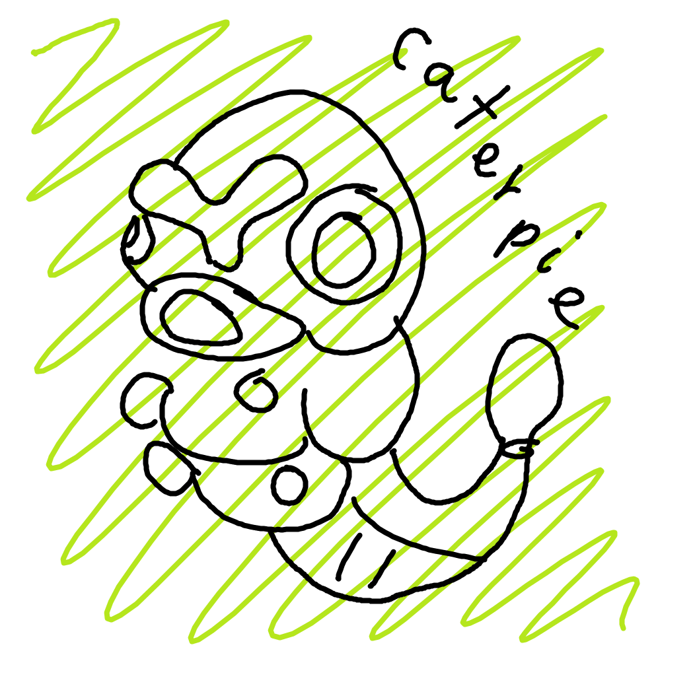
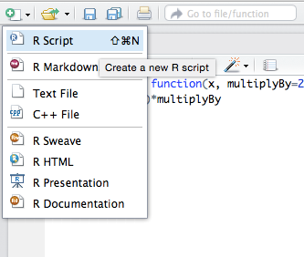
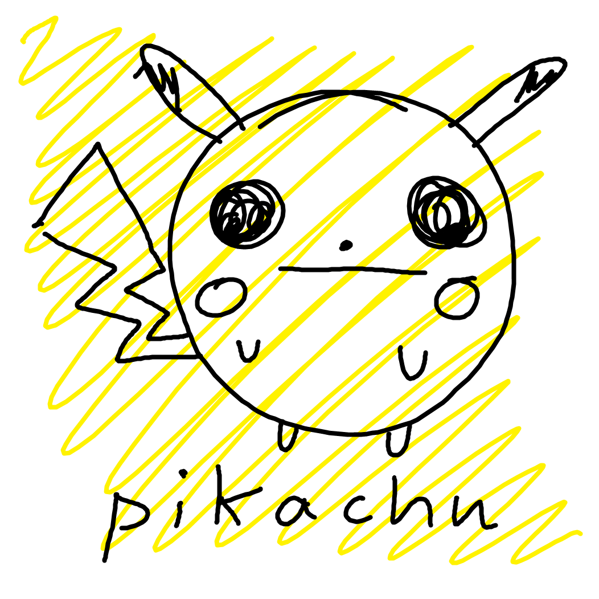
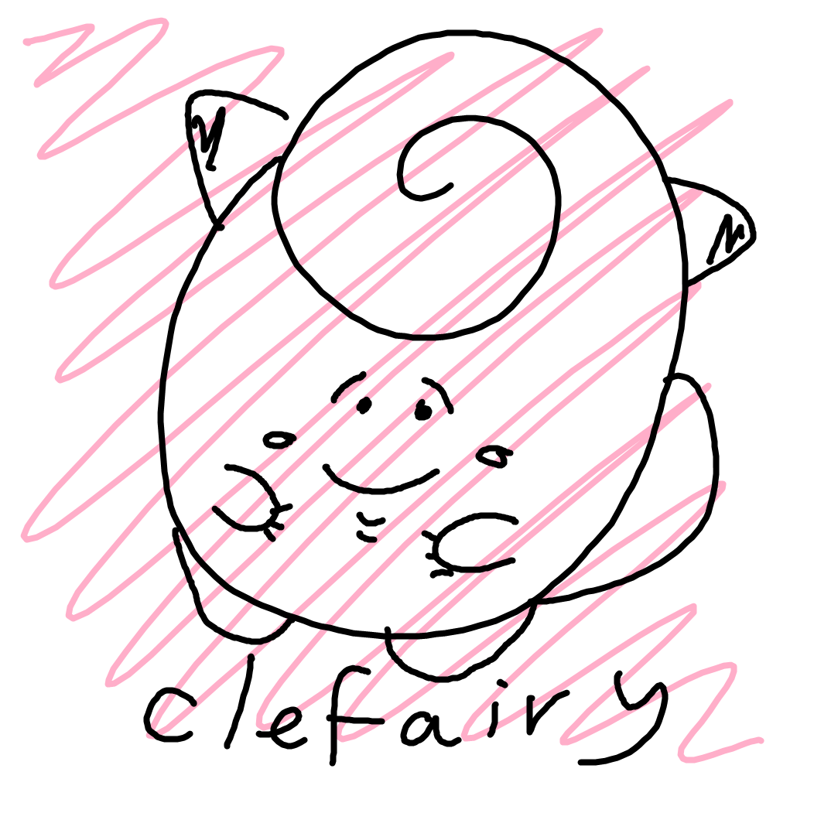
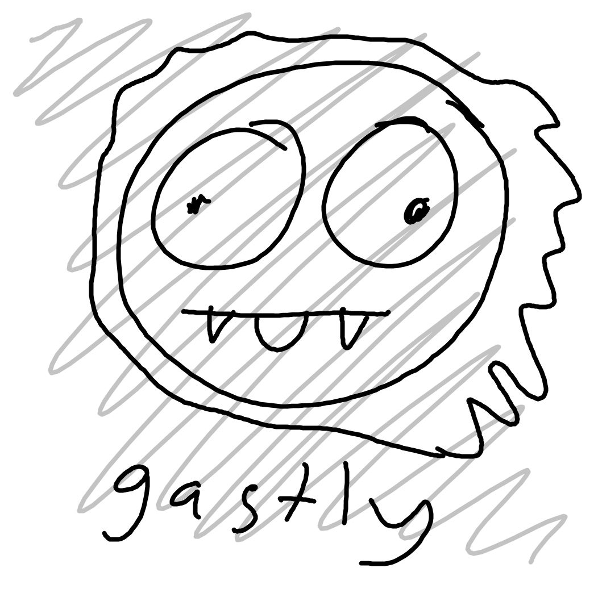
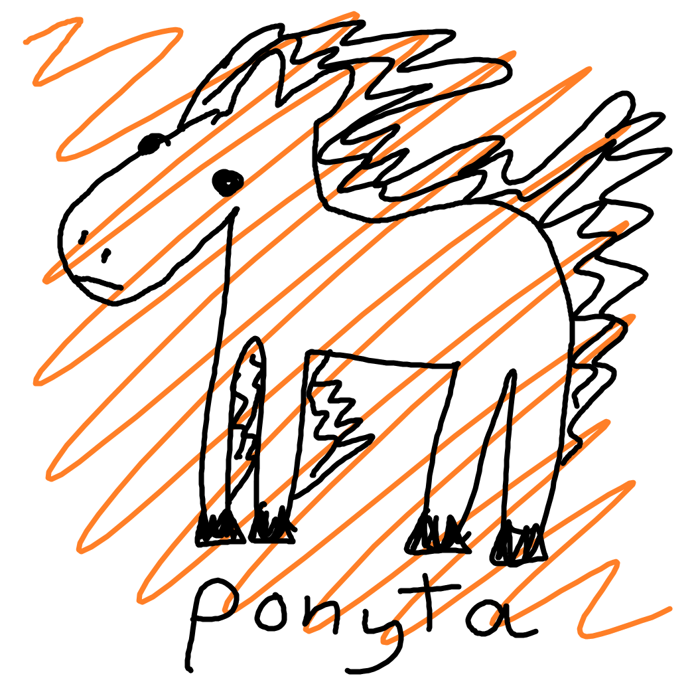
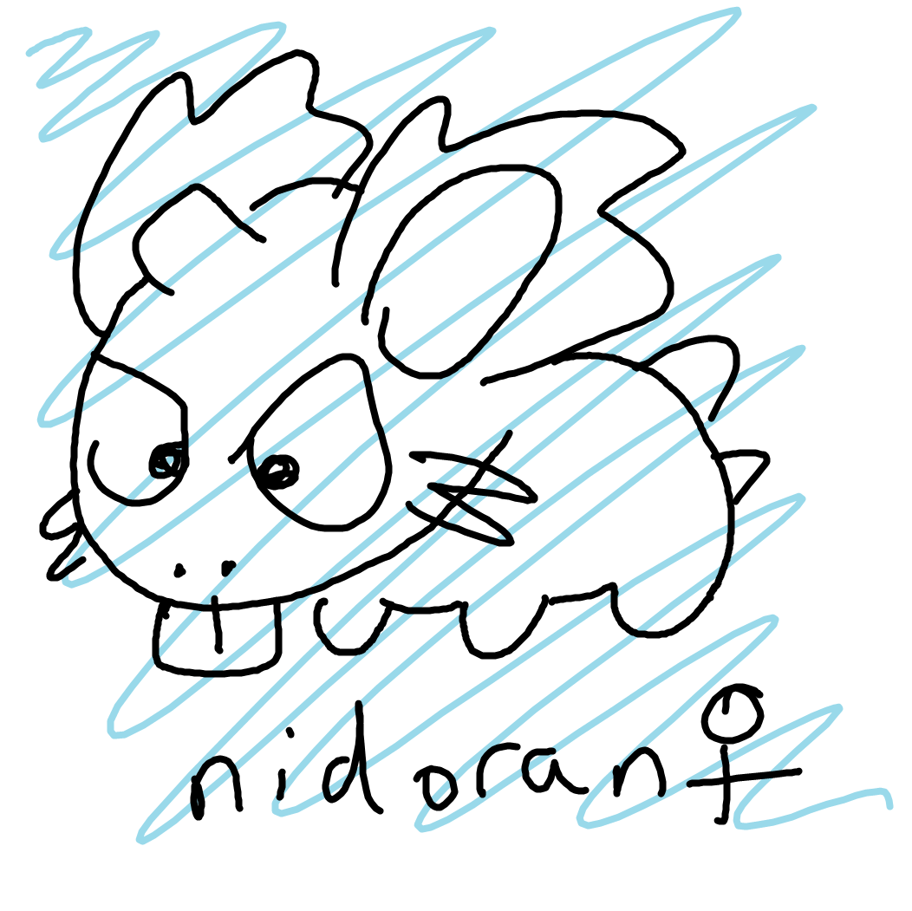
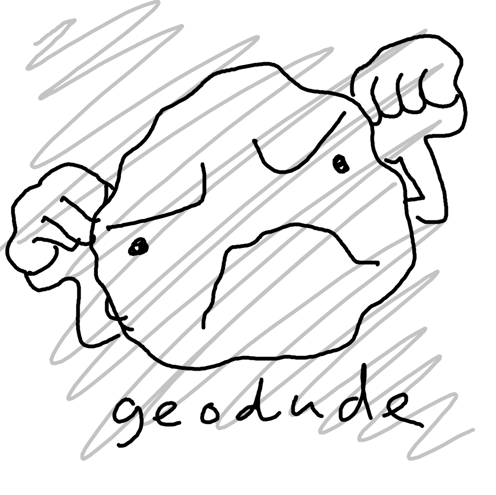

```{r setup, include=FALSE}
knitr::opts_chunk$set(echo = TRUE)
library(ggplot2)
```

<mark>This document is a work in progress -- give me feedback</mark>



# Introduction

## Before we begin

Do you have:

* R and RStudio downloaded from Software Center?
* the folder I sent this morning containing the data?

Good.

Hello.

* Who am I?
* Who are you?
* Why are we here? 
* What can you do with R?
* What do you want to be able to do?

(Note: these are not existential questions.)

## Who is this guide for?

Follow this guide if:

* you've never heard of R
* you've used SQL but not R
* you've never coded before
* you want to use R but don't consider yourself a 'programmer'

Dip into this guide if you:

* have used R but never made use of something called RStudio
* want to learn more about RStudio and how it works
* have used R but never made use of something called the 'tidyverse'
* want to learn the best way to set up an R project to improve reproducibility

## Disclaimers:

* this guide is a basic introduction and is *in no way exhaustive*
* there's usually more than one way to do things in R -- I've kept things simple here
* there's probably errors and spelling mistakes, etc

This document was originally written with a very specific public sector audience in mind and may contain references not relevant to you. See the Further Reading section at the bottom of this document if you want to find some other resources.

# What's the problem?

## Workflow

A typical analytical workflow in our department might involve SQL, Excel and Word. Typical steps might be:

1. Query a database with SQL code using SQL Server Management Studio
2. QA this code
3. Copy and paste the output into Excel
4. Process the data in Excel
5. Produce outputs (tables, plots, etc) manually in Excel
6. QA your Excel file(s)
7. Copy and paste outputs into a Word document
8. QA the Word document
9. You notice an error
10. Debug somehow (go back to step 1?)

There are three main reasons why this isn't ideal. It's:

* got a high chance of producing errors
* difficult to reproduce your work (what order were the steps in your workflow?)
* time consuming (many steps, lots of wasted time)

So, let's discuss what we mean by 'errors'. This is mostly a problem with spreadsheets and moving data in and out of them. You:

* might alter data without realising
* could copy-paste data or formulae incorrectly with little record of what steps you took (e.g. [this high profile case](https://www.bloomberg.com/news/articles/2013-04-18/faq-reinhart-rogoff-and-the-excel-error-that-changed-history))
* might not realise [how frequent these errors are](http://panko.shidler.hawaii.edu/SSR/Mypapers/whatknow.htm) until they get [embarrassing](https://www.cio.com/article/2438188/enterprise-software/eight-of-the-worst-spreadsheet-blunders.html)

In terms of reproducibility, you don't have a record of the order of doing things and therefore it's not easy to backtrack on mistakes. A lot of documentation and commenting is required within and across multiple files to ensure that the workflow can be replicated. Typically, this is not always the case. If you write reproducible code, it may also be easier to automate it. This in turn can help free-up time for other, perhaps less trivial, tasks. For example, the [Reproducible Analytical Pipeline](https://dataingovernment.blog.gov.uk/2017/03/27/reproducible-analytical-pipeline/) (RAP) approach helps reduce error and speed up the process of producing official statistics.

Obviously the process takes time because you have to copy-paste values from place to place and perform quality assurance across all the files in your workflow. But there's also the time needed to remember how you did the analysis when you're asked to make changes long after you remember how the process works.

## The bottom line

Our analytical work has a direct impact on policy decisions and therefore it affects young people, parents, learners, schools, teachers and many others. 

Above all *humans cannot be trusted*. Let's minimise the chance of errors, speed things up and make it easy on our future selves by minimising the chance of doing it wrong in the first place. This means breaking away from [spreadsheet addiction](http://www.burns-stat.com/documents/tutorials/spreadsheet-addiction/).

## R is the answer

What might an optimal analytical workflow look like in R?

1. Run your code

This is simple. R is end-to-end: you can get data in at one end from files or a database and pump it out the other in a report or app, while also having automated testing built in. All from the same script. You also have the opportunity to more easily version your work using tools such as [Git and GitHub](https://guides.github.com/activities/hello-world/). 

## But what is R?

R is a *just another tool* for data analysis, in the same way that Excel and SQL are tools for data analysis. 

Put simply, R lets you read, wrangle and analyse data and create outputs such as graphics, documents and interactive apps. R is a coding language, which means you use it to write instructions for the computer to perform. This allows for fine control of what you want to do. 

You can think of R as a place where data is abstracted away and the instructions are brought to the forefront, whereas spreadsheets are where data is at the forefront and the instructions are abstracted away (I heard this somewhere but can't remember the source; let me know).

RStudio is simply a very useful interface for R that provides a whole bunch of useful bells and whistles.

What's great about R? It's:

* free
* available on our work laptops via Software Center
* open-source and cross-platform (you can [download](https://cran.r-project.org/) it for Windows, Mac and Linux machines)
* established and has many high-quality extensions available ('packages')
* has a big and active community, both in the department (e.g. Coffee & Coding) and online (e.g. the [RStudio Community](https://www.community.rstudio.com/))
* got a lot of in-built help files 
* got a wealth of articles and help online (e.g. the [R bloggers](https://www.r-bloggers.com/) feed and via [StackOverflow](https://stackoverflow.com/questions/tagged/r))
* got excellent statistical and graphics capabilities in particular
* the suite of RStudio tools make documentation, teaching and dissemination much easier

I could go on.

## Should I stop using all other tools?

R is *not always* the answer. I'm not telling you that we *must* do things in any particular way. For example, you have an urgent request for the minister due in five minutes and you don't have the experience to do it in R. [Excel may be good enough.](http://www.mastodonc.com/data%20science/excel/2017/08/16/when-is-excel-good-enough.html) That's absolutely fine. The argument here is that we should move towards a more reproducible model, so that when the minister comes back wanting to tweak your calculation you can be confident that you can remember what you did and how you did it.

# Project working

Let's assume you're starting a new piece of work. Your life will be much easier if you manage the structure of your project *from the start*, rather than creating a horrible file dump of various data sets, code and documentation that you have no chance of untangling in a few months' time.

## RStudio Projects

We're going to start by creating an 'RStudio Project' (capital 'P').

Why do this? Well, it makes your work more:

* organised -- all the code, data, outputs, etc, are stored in one place (a single project folder)
* reproducible -- your code can be re-run from scratch to produce the same outputs every time
* transferable -- you can pass the entire project folder to someone else and they'll be able to run it on their own machine; the filepaths you specify in your code assume the home folder is the project folder, so you can write something like `data/dataset.csv` rather than `file/path/on/my/personal/machine/that/you/cannot/access.csv`

To set up an RStudio Project:

1. Open RStudio (the icon is a white R inside a blue circle; see top of this document)
2. File > New Project...
3. New Directory > New Project
4. Give your project a meaningful name in the 'Directory Name' box
5. Browse for the filepath where your R Project folder will be placed
6. Click 'Create Project' and RStudio will open your project (note the project name in the top right)

This process creates a directory -- a folder on your machine or shared drive that you choose -- containing a an RStudio Project file with the extension (suffix) '.Rproj'. The repository is the 'home' of your project and will house all the files and code that you need. Opening the .RProj file will open your RStudio Project as you last left it with the scripts you were working on. 

To access your R Project in future, navigate to the project folder and double-click your R Project file, which has the .Rproj extension (e.g. your-project.Rproj).

## Directory layout

So, your project directory contains an RStudio Project (.Rproj) file, but let's now fill it with some basic folders that we'll need to compelte our project. This helps keep things organised and can help prevent mishaps like accidentally deleting raw data. 

Organisation of projects from something like [designing projects](https://nicercode.github.io/blog/2013-04-05-projects/) by Rich Fitzjohn at Macquarie University.

The basic arrangement would be something like:


The files and folders are:

* *data* for raw, untouched, read-only data sets 
* *figs* for any graphics you produce (could also be *maps* or something else)
* *output* for data files processed from the raw data 
* separate script files (with extension .R) to be executed in the labelled order (more on this in the next section)
* the *.Rproj* file

# The RStudio interface

Don't be alarmed by the RStudio interface. There's lots of buttons and tabs, but we'll be restricting ourselves to a relatively small subset of these to begin with.

## Layout

RStudio is split into three *panes* when you open it first time:


Each of which has a few tabs. We care about a few of these tabs right now:

Left pane:

* the console tab where outputs are displayed (you can also directly type code into the console, but your code won't be saved) 

Upper-right pane:

  * the _Environment_ tab that fills when you create saved objects
  * the _History tab_ for seeing and rerunning any previous commands

Lower-right pane:

  * the _Files_ tab from which you can open files (it that defaults to your home folder where the .Rproj is stored for this project)
  * the _Plots_ tab for viewing plot outputs that you've created
  * the _Help_ tab for searching for help with R packages and functions

## Start a script

Open a new file with File > New File > R script, or in the top left of RStudio click the button with a '+' in a green circle on a white square, then click 'R Script':



A new pane will appear with a new scripting tab. It's blank. You type the code into this space and run it. The inputs and results are displayed in the console below once the script has been executed. This is not too dissimilar to what you get in SQL Server Management Studio, for example.

You can have more than one scripting tab open at once. Usually you would have one script per process. For example, one for reading and manipulating data (e.g. `01_read-data`), one for modelling (e.g. `02_model`)and one for plotting (`03_plot`), i.e. sensible names with a number that indicates the order to execute the code. This will improve reproducibility.

Start your script with some useful information. Anything prefixed with a hash (`#`) will be recognised as a comment and won't be executed as code. For example:

```{r header}
# Title: Sensational training script
# Purpose: To inspire new R users
# Name: Matt Dray
# Date: Jan 2018
```

You can copy-paste or type the code from this document into your R script as we go along. Remember to add comments with `#` to say what you're doing and to break your script up into sections.

## Execute code

Type `1 + 1` into your scripting window (upper left pane). To 'run' the code, make sure your cursor is on the line containing the code and use the keyboard shortcut 'Control + Enter' to execute it (alternatively, click the 'Run' button in the top right of the scripting window). This will only run the bit of code you've highlighted; it won't continue running the whole script.

```{r calculate}
1 + 1  # add one number to another
```

You should have got the answer `2`. The number in brackets relates to the number of items of information that are returned to you.

***
**CHALLENGE!**

Save your script with a sensible name.

Hint: File > Save, or Control + S. You'll be prompted to save the file in your home folder (the one containing your R Project file).

***

This is good, but ideally we want to store values to help simplify our code. We do this by making 'objects'. An object can be a single number, a list of strings, a table of data, a plot, or many other things. You create an object by assigning a name to your values. You do this with the 'assignment arrow', `<-`, which is basically akin to "into an object named the thing on the left, save the thing on the right".

For example, we can assign `1 + 1` to the object name `my_num` with `<-`. Execute the following code:

```{r define-object}
my_num <- 1 + 1  # store 1 + 1 as an object
```

Hm. Nothing printed out in the console. Instead the object is now in your environment -- see the top right pane in RStudio. You are now free to refer to this object by name in your script. For example, you can now print the contents of this object to the console with the line `print(my_num)` or explore it with the environment pane.

```{r print-object}
print(my_num)  # print the contents of the object to the console
```

Storing one value is fine. But objects can be used sed to store more than that. This next chunk of code creates a 'vector', where several values in the brackets have been combined together with the `c()` command. In this example I've created some character strings, each bound within a pair of quotation marks (`""`). Numbers don't need to be in quotation marks (unless they've been stored as text).

```{r vectors}
my_vector <- c("Pichu", "Pikachu", "Raichu")  # combine some values
print(my_vector)  # have a look at what the object contains
```

You can see what 'class' your vector is at any time with the `class()` function. 

```{r class-num}
class(my_num)
```

The vector `my_num` is composed of numbers only and so is 'numeric', but `my_vector` is composed entirely of character strings:

```{r class-char}
class(my_vector)
```

So we've create objects composed of both single values and vectors. You can think of these as being zero-dimensional and one-dimensional. The next step would be two dimenions: a table. Tables of data with rows and columns are called 'data frames' in R and are effectively a bunch of vectors of the same length stuck together. Consider this:

```{r df}
my_df <- data.frame(
  species = c("Pichu", "Pikachu", "Raichu"),
  number = c(172, 25, 26),
  location = c("Johto", "Kanto", "Kanto")
)

print(my_df)
```

Can you see how this is three vectors (`species`, `number` and `location`) of the same length (3 values) arranged into columns? the function `data.frame()` binds these vectors together into (surprise) a data frame.

```{r}
class(my_df)
```

Aha!

***
**CHALLENGE!**

Create a sensibly-named data frame object with three sensibly-named columns: 

* one for animals
* one for a cuteness score
* one for a ferocity score

Now print it.

***

## Functions

You've been using functions already: `print()`, `class()`, `data.frame()` and `c()`.

Theory: a *function* is a reproducible unit of code that performs a given task, such as reading a data file or fitting a model. Functions prevent you from copy-pasting your code multiple times, which could lead to errors and makes for unwieldy, unreadable code. If you can help it, [Don't Repeat Yourself](https://en.wikipedia.org/wiki/Don%27t_repeat_yourself).

functions are written as the function name followed by brackets. The brackets contain the *arguments* -- the items you need to provide to the function for it to work. One argument might be be a filepath to some data, another might describe the colour of points to be plotted. They're separated by commas.

So a generic function might look like this:

```{r generic-func, eval=FALSE}
# don't run this, it doesn't do anything!
function_name(
  data = my_data,
  colour = "red",
  option = 5
)  
```

Note that you can break the function over several lines. You can put your cursor on *any* of these lines and run it. You don't have to highlight the whole thing.

You can use type a question mark followed by a function name to learn about its arguments in a help file that will appear in the bottom right pane. For example, `?plot()`. Try it, but don't worry about the content for now.

Aside: you don't necessarily need to write the argument name and an equals sign. For example, if the first argument expected by `example_function()` is data (you can find out by running `?example_function()`) you can write `example_function(my_data)` instead of `example_function(data = my_data)`. It's good practice to write the argument names though, it'll help you and others to understand your code and to stop any confusion. For example, specifying the arguments `x = vector_x`  and `y = vector_y` in a plot function might make it clearer which axis is which when checking your code.

***
**CHALLENGE!**

It's good practice to reset R every so often.

Why might we do this?

Hit the keyboard shortcut Control + Shift + F10 for RStudio to reset.

***

## Packages

Functions can be bundled into *packages*. A bunch of packages are pre-installed with R, but there are thousands more available for download. These packages extend the basic capabilities of R.

Packages can be installed to your computer using the `install.packages()` function. This automatically fetches and downloads packages from the [Comprehensive R Archive Network](https://cran.r-project.org) (CRAN).

Here are three packages that we're going to use in this session:

```{r install, eval=FALSE}
install.packages(pkgs = "readr")  # for reading data into R
install.packages(pkgs = "dplyr")  # for manipulating data
```

You only need to run the installation function *once* for each package. The package is installed to your computer once you've done this and you only need to 'remind' RStudio where to find the package using the `library()` function in future.

So now we have the `readr` and `dplyr` packages installed we can call them with the `library()` function so we can use them.

```{r library}
library(package = "readr")
library(package = "dplyr")
```

Sometimes a package will print a message in the console after loading. This is usually fine and only a problem in very specific circumstances. For example, you might be told that the package was developed using a newer version of R, or perhaps that a function from that package 'conflicts' with another already-installed function (usually because the two functions have the same name).

Okay, let's get hold of some data!

# Get data in and look at it

## Read the data

Let's use a dataset that I collected myself. It contains information about organisms I collected from exotic locations spanning the globe from Napoli to Hastings. It's a file containing a data set of about 700 [Pokemon](https://en.wikipedia.org/wiki/Pokémon) -- captured on the [Pokemon Go](https://en.wikipedia.org/wiki/Pokémon_Go) app -- with their characteristics data. *It's the very best dataset, like no dataset ever was.*

If I haven't given you the dataset already as a Comma-Separated Values (CSV) file, you can download it from the internet via [GitHub](https://github.com/mwdray/datasets/blob/master/pokemon_go_captures.csv). Save it to a folder named 'data' in your R Project folder like so:

```{r}
download.file(
  url = "https://raw.githubusercontent.com/mwdray/datasets/master/pokemon_go_captures.csv",
  destfile = "data/pokemon_go_captures.csv"  # where to save it to
)
```

And then you can read it in as follows:

```{r}
pokemon <- read_csv(file = "data/pokemon_go_captures.csv")
```

This function loads the data from the CSV file at the filepath provided (it's in our 'data' folder). It prints a note to the console to tell you the columns that have been read in and also what the data type of each one is. For example, `combat_power = col_integer()` tells us that the data in this column has been read as integers.



But *where* is this data? How do we know it's actually been read in?

If you look at the 'Environment' tab in the top-right pane of RStudio, you'll see our object 'pokemon' is there. Helpfully, we're told it has dimensions of 696 rows and 9 columns.

## Data inspection

The first thing we should do is look at the data to check for anomalies. There are a number of ways to do this.

You can take a look at information about your data frame using:

```{r glimpse}
glimpse(pokemon)
```

Immediately this tells us that there are 696 rows and 9 columns. Column names are then listed with the data type and first few examples. This infomration is also available in the environment tab in the upper-right pane. Click the little blue arrow to have this infomration drop down.

Another way of expressing this is to simply `print()` to the console. The output is displayed in table format, but is truncated to fit the console window (this prevents you from printing millions of rows to the console!).

```{r print}
print(pokemon)
```

If you want to see the whole datset you could use the `View()` function:

```{r View, eval=FALSE}
View(pokemon) # note the capital 'V'
```

This opens up a read-only tab in the script window that displays your data in full. You can scroll around and order the columns by clicking the headers. This doesn't affect the underlying data at all.

You can also access this by clickng the little image of a table to the right of the object in the environment pane (upper-right). 

## Quick summary

You can get very quick summary statistics with the `summary()` function. The function provides a quick summary of each column depending on its data type (integer, character, etc). This is pretty basic, but we'll do something more impressive later.

```{r summary}
summary(pokemon)
```


# Manipulating the data frame

We're going to use a number of sensibly-named functions from the `dplyr` package to do our data manipulation. These functions take verbs -- not too dissimilar to SQL verbs -- as their names. This makes it easy to understand what they're doing. 

`dplyr` is part of a suite of packages within what is called '[the Tidyverse](https://www.tidyverse.org)'. These packages are all written with the same thoughts in mind (e.g. the first argument of all the functions is the data, function names are sensible and written in snake_case, the code is optimised to run quickly, etc).

The tidyverse aims to make things simpler and fasterfor R coders.

## Select

Firstly, we can `select()` columns of interest. There's the first sensible function name. You'll notice that a lot of them are verbs to make it clear that the code is actively *doing* something.

```{r select-1}
# save as an object for later
pokemon_hp <- select( 
  pokemon,  # the first argument is always the data
  hit_points,  # the other arguments are column names you want to keep
  species
)  

print(pokemon_hp)
```

Note that the order you select the columns is the order they'll appear in when they print.

And we can choose not to include certan columns by prefixing with `-` (hyphen/minus).

```{r select-2}
select(
  pokemon,  # data frame first
  -hit_points, -combat_power, -fast_attack, -weight_bin  # columns to drop
)
```

That can be quite laborious, so there are some special functions we can use inside the select function to help us out.

For example, selecting columns starting with a particular string:

```{r select-3}
select(pokemon, starts_with("weight"))
```

Or any columns containing a given string.

```{r select-4}
select(pokemon, contains("bin"))
```

***
**CHALLENGE!**

Create an object called `my_selection` that uses the `select()` function to store from `pokemon` the species column and any columns that end with with `"attack"`

***

More infomration in the help file if you type `?select`.


## Filter

Now for subsetting the data by its rows.

We're going to make use of some common [logical operators](https://stat.ethz.ch/R-manual/R-devel/library/base/html/Logic.html) for subsetting our data by certain conditions:

* `==` -- equals
* `!=` -- not equals
* `%in%` -- match to several things listed with `c()`
* `>`, `<`, `<=`, `>=` -- greater/less than (or equal to)
* `&` -- 'and'
* `|` -- 'or'

Let's start by filtering for one particular species.

```{r filter-1}
filter(pokemon, species == "jigglypuff")
```

Now everything *except* for one species.

```{r filter-2}
filter(pokemon, species != "pidgey")  # not equals to
```

Now filtering to include three species only.

```{r filter-3}
filter(
  pokemon,
  species %in% c("staryu", "psyduck", "charmander")
)
```

We can work with numbers too.

```{r filter-4}
filter(
  pokemon,
  combat_power > 900 & hit_points < 100  # two conditions
)  # note the '&'
```

***
**CHALLENGE!**

Filter the `pokemon` dataframe to include species rows that:

* are the species "abra", "chansey", or "bellsprout"
* *and* have between 100 and 400 `combat_power` (hint: you'll need an `&`)
* *and* less than 100 `hit_points`

How many Pokemon are in this subset?

***



## Mutate

Now to create new columns. We use `mutate()` because we're *mutating* our dataframe -- we're budding a new column where there wasn't one before. Often you'll be creating new columns based on the content of columns that already exist, or you can fill the entire column with one thing.

For now, we're going to create column names without spaces. It's easier.

```{r mutate}
# we're going to subset by columns first
pokemon_power_hp <- select(  # create new object by subsetting our data set
  pokemon,  # data
  species, combat_power, hit_points  # columns to keep
)

# now to mutate with some extra information
mutate(
  pokemon_power_hp,  # our new, subsetted data frame
  power_index = combat_power * hit_points,  # new column from old ones
  caught = 1,  # new column will fill entirely with number
  area = "kanto"  # will fill entirely with this text 
)
```

So we have a column `caught` filled for every row with `1` and and a column filled with `kanto` for every row. R 'recycles' whatever you put there for each row. For example, if you gave the argument a vector of three numbers, e.g. `caught = c(1:3)`, then the row 1 would get `1`, row 2 would get `2`, row 3 would get `3` and it would cycle back to `1` for row 4, and so on.

You can mutate a little more easily with an `if_else()` statement:

```{r mutate-ifelse}
mutate(
  pokemon_hp,
  common = if_else(
    condition = species %in% c(  # if this condition is met...
      "pidgey", "rattata", "drowzee", 
      "spearow", "magikarp", "weedle", 
      "staryu", "psyduck", "eevee"
    ),
    true = "yes",  # ...fill column with this string
    false = "no"  # ...otherwise fill it with this string
  )
)
```

And we can get more nuanced by using a `case_when()` statement ([you may have seen this in SQL](https://www.w3schools.com/sql/func_mysql_case.asp)). This prevents us writing nested `if_else()` statements to specify multiple conditions.

```{r mutate-casewhen}
mutate(
  pokemon_hp,  # data
  common = case_when(
    species %in% c("pidgey", "rattata", "drowzee") ~ "very_common",
    species == "spearow" ~ "pretty_common",
    species %in% c("magikarp", "weedle", "staryu", "psyduck") ~ "common",
    species == "eevee" ~ "less_common",
    TRUE ~ "no"
  )
)
```

***
**CHALLENGE!**

Create a new datafrmae object that takes the `pokemon` data and adds a column containing Pokemon body-mass index (BMI).

Hint: BMI is weight over height squared (you can square a number by writing `^2` after it).

Now use a `case_when()` to categorise Pokemon:

* Underweight = <18.5
* Normal weight = 18.5–24.9 
* Overweight = 25–29.9 
* Obesity = BMI of 30 or greater

Note that these are BMI groups for humans. And that BMI has [many limitations](https://en.wikipedia.org/wiki/Body_mass_index#Limitations)!

***



## Arrange

This does what it says on the tin. This alters the order of the rows in your table according to some column specification.

```{r arrange}
arrange(
  pokemon,  # again, data first
  height_m  # column to order by
)
```

And in reverse order (tallest first):

```{r arrange-desc}
arrange(pokemon, desc(height_m))  # descending
```

***
**CHALLENGE!**

What happens if you arrange by a column containing characters rather than numbers? For example, the `species` column.

***

## Join

Again, another verb that mirrors [what you can find in SQL](https://www.w3schools.com/sql/sql_join.asp). There are several types of join, but we're going to focus on the most common one: the `left_join()`. This joins information from one table -- `x` -- to another -- `y` -- by some key matching variable of our choice. 

Let's start by reading in a lookup table that provides some extra infomration about our species.

```{r read-pokedex}
pokedex <- read_csv("data/pokedex_simple.csv")

glimpse(pokedex)  # let's inspect its contents
```

Now we're going to join this new data to our `pokemon` data. The key for matching these in the `species` column, which exists in both datasets. 

```{r join}
pokemon_join <- left_join(
  x = pokemon,  # to this table...
  y = pokedex,   # ...join this table
  by = "species"  # on this key
)

glimpse(pokemon_join)
```

***
**CHALLENGE!**

Try `right_join()` instead of `left_join()`. What happens? And what about `anti_join()`?

***



## Other verbs

This document does not contain an exhaustive list of other functions within the same family as `select()`, `filter()`, `mutate()`, `arrange()` and `*_join()`. There are other functions that will be useful for your work and other ways of manipulating your data. For example, the `stringr` package helps with dealing with data in strings (text, for example).

## Pipes

Alright great, we've seen how to manipulate our dataframe a bit. But we've been doing it one discrete step at a time, so your script might end up looking something like this:

```{r workflow-no-pipe, eval=FALSE}
pokemon <- read_csv(file = "data/pokemon_go_captures.csv")

pokemon_select <- select(pokemon, -height_bin, -weight_bin)

pokemon_filter <- filter(pokemon_select, weight_kg > 15)

pokemon_mutate <- mutate(pokemon_filter, organism = "pokemon")
```

In other words, you might end up creating lots of intermediate variables and cluttering up your workspace and filling up memory.

You could do all this in one step by nesting each function inside the others, but that would be super messy and hard to read. Instead we're going to 'pipe' data from one function to the next. The pipe operator -- `%>%` -- says 'take what's on the left and pass it through to the next function'.

So you can do it all in one step:

```{r pipe}
pokemon_piped <- read_csv(file = "data/pokemon_go_captures.csv") %>% 
  select(-height_bin, -weight_bin) %>% 
  filter(weight_kg > 15) %>% 
  mutate(organism = "pokemon")

glimpse(pokemon_piped)
```

This reads as:

* for the object named `pokemon_piped`, assign (`<-`) the contents of a CSV file read with `read_csv()`
* *then* select out some columns
* *then* filter on a variable
* *then* add a column

See how this is like a recipe?

Did you notice something? We didn't have to keep calling the dataframe object in each function call. For example, we used `filter(weight_kg > 15)` rather than `filter(pokemon, weight_kg > 15)` because the data argument was *piped in*. The functions mentioned above all accept the data that's being passed into them because they're part of [the Tidyverse](https://www.tidyverse.org). (Note that this is not true for *all* functions, but we can talk about that later.)

Here's another simple example using the dataframe we built earlier:

```{r pipe-2}
my_df <- data.frame(
  species = c("Pichu", "Pikachu", "Raichu"),
  number = c(172, 25, 26),
  location = c("Johto", "Kanto", "Kanto")
)

my_df %>%  # take the dataframe object...
  select(species, number) %>%   # ...then select these columns...
  filter(number %in% c(172, 26))  # ...then filter on these values

```

Nice and easy to read.

***
**CHALLENGE!**

Write a pipe recipe that creates a new dataframe called `my_poke` that takes the `pokemon` dataframe and:

* `select()`s only the `species` and `combat_power` columns
* `left_join()`s the `pokedex` dataframe by `species`
* `filter()`s by those with a `type1` that's 'normal'

***



# Summaries

Assuming we've now wrangled out data using the `dplyr` functions, we can do some quick, readable summarisation that's way better than the `summary()` function.

So let's use our knowledge -- and some new functions -- to get the top 5 pokemon by count.

```{r summarise-1}
pokemon %>%  # take the dataframe
  group_by(species) %>%   # group it by species
  tally() %>%   # tally up (count) the number of instances
  arrange(desc(n)) %>%  # arrange in descending order
  slice(1:5)  # and slice out the first five rows
```

The order of your functions is important -- remember it's like a recipe. Don't crack the eggs on your cake just before serving. Do it near the beginning somewhere, I guess (I'm not much a cake maker).

There's also a specific `summarise()` function that allows you to, well... summarise.

```{r summarise-2}
pokemon_join %>%  # take the dataframe
  group_by(type1) %>%   # group by variable
  summarise( # summarise it by...
    count = n(),  # counting the number
    mean_cp = round(mean(combat_power), 1)  # and taking a mean to 2 dp
  ) %>% 
  arrange(desc(mean_cp))  # then organise in descending order of this column
```

Note that you can group by more than one thing as well. We can group on the `weight_bin` category *within* the `type1` category, for example.

```{r group-by-2}
pokemon_join %>%
  group_by(type1, weight_bin) %>% 
  summarise(
    mean_weight = mean(weight_kg),
    count = n()
  )
```



# Plot the data

We're going to keep this very short and dangle it like a [rare candy](https://bulbapedia.bulbagarden.net/wiki/Rare_Candy) in front of your nose. We'll revisit this in more depth in a later session. For now, we're going to use a package called `ggplot2` to create some simple charts.

***
**CHALLENGE!**

Remember how to use packages? Install `ggplot2` and load it from the library.

***

The 'gg' in 'ggplot2' stands for 'grammar of graphics'. This is a way of thinking about plotting as having a 'grammar' -- 'elements that can be applied in succession to create a plot. This is 'the idea that you can build every graph from the same few components': a *data set*, *geoms* (marks representing data points), a *co-ordinate system* and some other things.

The `ggplot()` function from the `ggplot2` package is how you create these plots. You build up the graphical elements using the `+` rather than a pipe. Think about it as placing down a canvas and then adding layers on top.


```{r ggplot}
pokemon %>%
  ggplot() +
  geom_boxplot(aes(x = weight_bin, y = combat_power))
```

`ggplot` plays nicely with the pipe -- it's part of the Tidyverse -- so we can create recipes that combine data reading, data manipulation and plotting all in one go. Let's do some manipulation before plotting and then introduce some new elements to our plot that simplify the theme and change the labels.

```{r}
pokemon_join %>%
  filter(type1 %in% c("fire", "water", "grass")) %>% 
  ggplot() +
  geom_violin(aes(x = type1, y = combat_power)) +
  theme_bw() +
  labs(
    title = "CP by type",
    x = "Primary type",
    y = "Combat power"
  )
```

How about a dotplot? Coloured by `type1`?

```{r}
pokemon_join %>%
  filter(type1 %in% c("fire", "water", "grass")) %>% 
  ggplot() +
  geom_point(aes(x = pokedex_number, y = height_m, colour = type1))
```

***
**CHALLENGE!**

Create a boxplot for Pokemon with `type1` of 'normal', 'poison', 'ground' and 'water' against their `hit-points`

***

Simple, but relatively effective. We'll look next time at plotting in more depth. For example, yes: you *can* use [Pokemon sprites as your plotting points](https://twitter.com/guangchuangyu/status/844483732920684544). And why stop there? You can also [use specific Pokemon typing colours, sprite colour palettes and theme your barplot like a Pokemon first generation HP bar](https://github.com/schochastics/Rokemon/blob/master/README.md). *Cool, eh?*

# Further reading

## Tutorials

* [An Introduction to Statistical and Data Sciences via R](http://moderndive.com/) by ModernDive (my current favourite training material)
* [R for Data Science](http://r4ds.had.co.nz/) and [exercise solutions](https://jrnold.github.io/r4ds-exercise-solutions/)
* [Swirl](http://swirlstats.com/) teaches you R interactively, from within RStudio itself!
* [Try R](http://tryr.codeschool.com/levels/1/challenges/3) in-browser learning
* [Basics of 'tidy' data and the 'tidyverse' of packages](http://rpubs.com/aelhabr/tidyverse-basics)
* [DataCamp's Introduction to the Tidyverse](https://www.datacamp.com/courses/introduction-to-the-tidyverse) (£)
* [Data wrangling, exploration, and analysis with R](http://stat545.com/) from STAT 545 at the Uni of British Columbia
* [Online learning from RStudio](https://www.rstudio.com/online-learning/): R Programming, Shiny, R Markdown and Data Science
* An [exhaustive Quora question](https://www.quora.com/What-are-some-good-resources-for-learning-R-1) with links to resources
* Learn [RMarkdown for reproducible documents](http://rmarkdown.rstudio.com/lesson-1.html)
* Learn [R Shiny for interactive web apps](https://shiny.rstudio.com/tutorial/)
* Harvard tutorial page on [ggplot2](http://tutorials.iq.harvard.edu/R/Rgraphics/Rgraphics.html)
* Blog post on [Reproducible Analytical Pipelines](https://dataingovernment.blog.gov.uk/2017/03/27/reproducible-analytical-pipeline/) from Government Digital Services

## Help/tips and tricks

* Often it helps to produce a small [reproducible example](https://www.tidyverse.org/help/#reprex) (a 'reprex') of your code if you run into trouble
* [Getting help with R](https://support.rstudio.com/hc/en-us/articles/200552336-Getting-Help-with-R) page of resources from RStudio
* [RStudio cheatsheets](https://www.rstudio.com/resources/cheatsheets/) (including help with `readr`, `dplyr` and `ggplot2`)
* Explore questions and answers on [Stackoverflow](https://stackoverflow.com/questions/tagged/r)
* [R graph gallery](https://www.r-graph-gallery.com/)
* [Starting data analysis/wrangling with R: Things I wish I'd been told](http://reganmian.net/blog/2014/10/14/starting-data-analysiswrangling-with-r-things-i-wish-id-been-told/)
* Further information about R Projects is available from the [RStudio Support pages](https://support.rstudio.com/hc/en-us/articles/200526207-Using-Projects)